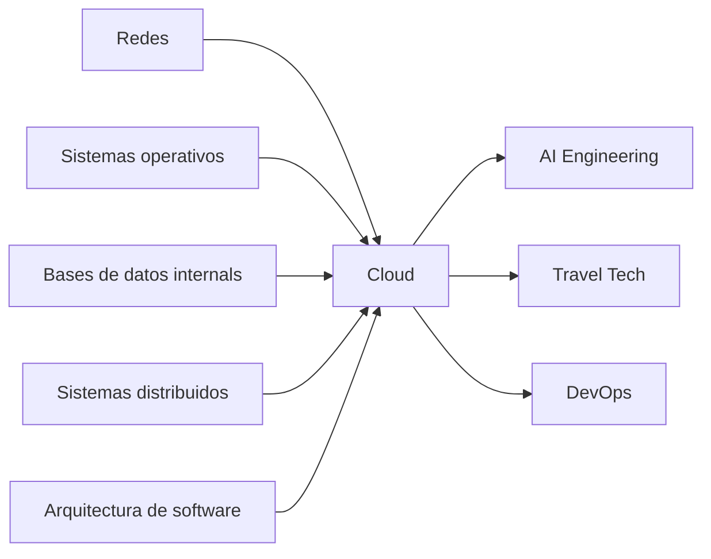

# Mapa global del curso

Cloud se ubica en el Semestre 5 como complemento directo de Arquitectura de
software. Arquitectura enseña límites internos; Cloud enseña plataformas,
responsabilidades delegadas y costos operativos.

